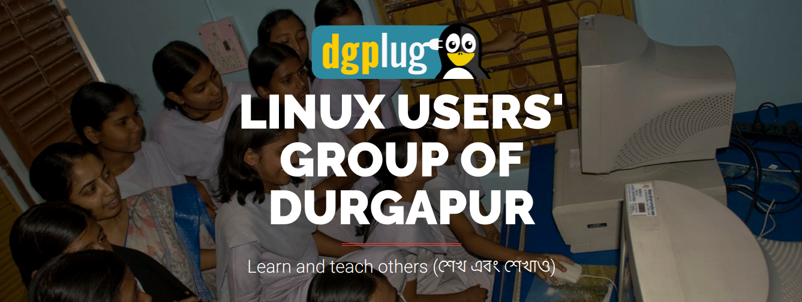

Skimming through your seniors’ profile does some good at times!

> “The programmers of tomorrow are the wizards of the future !”  
– Gabe, Co-founder-Valve

LINUX USERS’ GROUP OF DURGAPUR 
Learn and teach others 

An excerpt from the [official site](https://dgplug.org/summertraining18/) :-

# Objectives

- Revisiting programming fundamentals
- Get acquainted with Free Software technologies
- Spreading the hacker ethics
- Gaining technical knowledge
-Real-world project experience

What I have learnt within the month at #dgplug online summer training is invaluable to me! We get to talk and learn from the Jedi of F/OSS, attend Guest sessions with international upstream contributors and so much more!

An excerpt from a qoura [answer](https://www.quora.com/How-is-the-summer-training-at-Dgplug) :-

> ***How is the summer training at Dgplug?***
>    
>For me, it was like Hogwarts, a place which normal people don’t know, yet full of surprises, and new learning! It opened a whole new world for me!  
-Avik Mukherjee

And frankly, that makes the two of us.

