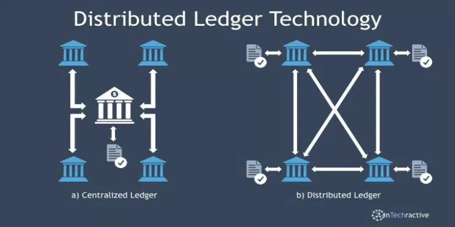
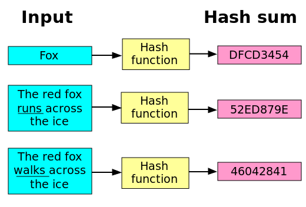

> Blockchain is a vast, **global distributed ledger** or database running on millions of devices and open to anyone, where not just information but anything of **value** — money, but also titles, deeds, identities, even votes — can be moved, stored and managed securely and privately. Trust is established through mass collaboration and clever code rather than by powerful intermediaries like governments and banks.  
–Wikinomics

So I’ve been reading all about blockchains (even those 12 point font research papers!). This is a rough gist of what I learnt:-

## A distributed ledger

Wikipedia [explains](https://en.wikipedia.org/wiki/Distributed_ledger) thus –

> “A distributed ledger is a consensus of replicated, shared, and synchronised digital data geographically spread across multiple sites, countries, or institutions. There is no central administrator or centralised data storage.”

This seems too much condensed. Let me break it down for you.

- There is no central authority.
- Every transaction here occurs in front of an array of guards that maintain order and make sure the transactions are completed in full by both parties.
- These guards are just some computers that have volunteered to become a ‘node’. Only these nodes can validate the transactions of every user on a blockchain.

Before we go any further, I need to tell you what a transaction means in this context.

> A transaction occurs when there is an exchange of data between any two parties. It need not be money only. It can be any data, you can even make a deal involving official papers of properties through some blockchain implementing platform!

And if this sounds scary, don’t worry; no-one, not even those nodes (the ones which supervise the transactions) know what exactly you exchanged! Kudos to privacy! And that’s not even half of it! I’ll explain more later.

Consider the conventional case of a bank (a conventional central authority).

> NOTE : We are using ‘bank’ as an example just because it comprises a good amount of ‘transactions’. Always remember that these ‘transactions’ can be of data or goods too!

So here, in a bank, all the transactions occurring between accounts would be verified by a single, central authority, and all your possessions currently with the bank would be at the mercy of the whims of the bank, the **single point of security** in the transaction. If, by any chance, the bank burns down (physical damage to central authority) or gets robbed (or hacked), or seizes your account (unethically or otherwise) , there would be consequences, the likes of which you most probably won’t be comfortable with.

Enter blockchain with the power of consensus based distributed ledger! If we consider the case of bitcoin blockchain, there are about 7000 nodes in the network that all work for the security of all those precious bitcoins that keep soaring and falling by the minute. For bitcoin to fail, all these 7000 points of security would have to be attacked at the same time, or at-least half of them. Not only that, with the sky-high pricing of these virtual currencies, more and more people are opting in to become nodes, which adds to security of the users(traders) making transactions over bitcoin blockchain. *So that’s security for you and the ‘things’ you love!* If you wish to know more about blockchain that deals with data, check out ethereum. Ethereum is an open-source, public, blockchain-based distributed computing platform and operating system featuring smart contract functionality.

## **Block**
A block is the ‘current’ part of a blockchain, which records some or all of the recent transactions. Once completed, a block goes into the blockchain as a permanent database. Each time a block gets completed, a new one is generated. There are countless such blocks in the blockchain, connected to each other (like links in a chain) in proper linear, chronological order. Every block contains a hash of the previous block. The blockchain has complete information about different user addresses and their balances right from the genesis block to the most recently completed block. Every node on the blockchain has a copy of the ledger with themselves, that gets synced after creation of a new block.
## The ‘what’ block ?
Every blockchain has to start somewhere, so there’s what’s called a **genesis block** at the beginning. This is the first block, and there, at the beginning, the creators of Ethereum (or any other cryptocurrency) were at liberty to say “*To start, the following accounts all have X units of my cryptocurrency.*” Any transfer of data on the blockchain will have originated from one of these initial accounts (or from mining).

The blockchain was designed so these transactions are immutable, meaning they cannot be deleted. The blocks are added through cryptography (more, later), ensuring that they remain meddle-proof: The data can be distributed, but not copied (a node never knows exactly what’s in these transactions). You can always see a block yourself by using a Blockchain Explorer.

## Privacy – how?
The blockchain isn’t just a bunch of computers watching that A sent something to B in return for some data; it’s so much more than that! On-chain transactions refer to those cryptocurrency transactions which occur on the blockchain – that is, on the records of the blockchain – and remain dependent on the state of the blockchain for their validity. All such on-chain transactions occur and are considered to be valid only when the blockchain is modified to reflect these transactions on the public ledger records.

## What the crypto?!
So how does *cryptography* exactly fit in with this blockchain? It’s simple- the nodes lock the data with a  256 bit number (Hash Sum) that represents the data within a block. A different blockchain may use a different hash function, but the basic idea of its integration in the blockchain remains the same (more or less).

### Hashing Functions

 <a href="https://en.wikibooks.org/wiki/File:Hash_function.svg">source</a>

If you look closely, you’ll notice even a slight change (even just 1 bit) in the data would create a different hash sum altogether. ***There is simply no pattern at all!***

So here comes the answer to a question that might’ve struck you-

> Why would anyone waste her/his own electricity and compute power to validate my transactions? Social service? Repentance out of guilt?

It’s MONEY!

There are nodes, there are traders, then there are MINERS.

Miners are a subset of nodes as all miners must be running a full node (ie they must have complete ledger with themselves) in order to mine (at least to mine properly). The nodes are what determine consensus as **all nodes must agree to the same rules otherwise the nodes will fork off of the network.**

Continue Reading

