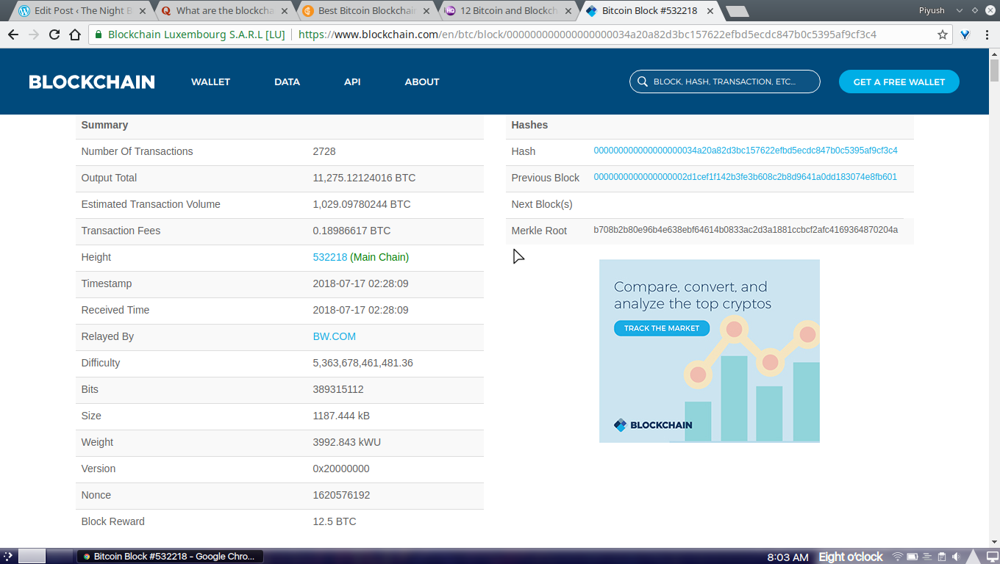

### They’ll what ?
They’ll fork off of the network.

A byproduct of distributed consensus, forks happen anytime two miners find a block at nearly the same time. The ambiguity is resolved when subsequent blocks are added to one, making it the longest chain, while the other block gets “orphaned” (or abandoned) by the network.

But forks also can be willingly introduced to the network. This occurs when developers seek to change the rules the software uses to decide whether a transaction is valid or not. Forks can be classified into two- hard and soft forks; both have different implications for the network and ecosystem.

Hard forks are a permanent divergence in the the block chain, commonly occurs when non-upgraded nodes can’t validate blocks created by upgraded nodes that follow newer consensus rules.

Soft forks are a temporary divergence in the block chain caused by non-upgraded nodes not following new consensus rules

Miners can add blocks to the blockchain so long as every other node on the network agrees that their block fits the consensus rules and accepts it.
### The Block Header
So what do these miners do exactly? They hash the block header. It is 80 bytes of data that will ultimately be hashed.

The header contains this info:

| Name 	       |Byte Size| 	Description                                         |
|--------------|---------|------------------------------------------------------|
|Version 	   |  4 	 |Block version number                                  |
|Previous Hash | 32 	 |This is the previous block header                     |
|Merkle Root   | 32 	 |The hash based on all of the transactions in the block|
|Time 	       | 4 	     |Current time stamp as seconds (unix format)           |
|Bits 	       | 4 	     |Target value in compact form                          |
|Nonce         | 4 	     |User adjusted value starting from 0                   |

A snap of the latest block at Bitcoin blockchain at the time of writing.</a>

## How would the consensus deem a mined block as accepted?
See the **Bits** part ? It is the Integer (Base 10) representation of the *target* that is to be achieved by the miners. The *target* is the 256 bit hash sum of the block header. It is the MAXIMUM value acceptable by the consensus for the hash.

### MAXIMUM value?
I thought you’d never ask! See the **nonce** part in the block header? Yup, miners need to start all the way from 0 (some may try to skip values, completely up to miner) to the number that when used in the block header, yields a hash sum below the target. See the nonce in the latest block image? The miner who successfully relayed this value to the nodes received the price money ie 12.5 BTC! That’s a lot of work and indeed a lot of bucks!

People buy special hardware (recent scarcity of GPUs? Curse those miners) and even computers specially built for this purpose! Ever heard of [ASICs](https://www.trymining.com/pages/asic-vs-gpu)?

As it stands, mining on your won, on your single PC is almost dead. The process of finding blocks is now so crowded and the difficulty of finding a block so high that it would take over an year to generate any coins on an average high-end gaming system. While you could simply set a machine aside and have it run the algorithms endlessly, the energy cost and equipment degradation and breakdown will eventually cost more than the actual bitcoins are worth.

**Pooled mining**, however, is far more lucrative. Using a service  you can split the work among a ground of people. Using this equation:

> (12.5 BTC + block fees – 2% fee) * (shares found by user’s workers) / (total shares in current round)

Putting it simply, it is basically how the system works. You work for shares in a block and when complete you get a percentage of the block reward based on the number of workers alongside you. More the people in pool, higher the chances of rewards.

## Types of Blockchains in use

Any blockchain can be classified into any one of these categories-

### Public Blockchain
The most basic of all blockchain concepts. This is the blockchain everyone uses out there.

The most basic features of this bockchain are –

> Anyone can run a BTC/LTC full node and start mining.  
> Anyone can make transactions on the BTC/LTC chain.  
> Anyone can review/audit the blockchain in a Blockchain explorer.

Example: [Bitcoin](http://bitcoin.org/), [Litecoin](https://litecoin.org/) etc.

### Private Blockchain

Private blockchain as its name suggests is a private property of an individual or an organization. Unlike public blockchain, here there is actually someone in charge who looks after important things such as read/write or whom to selectively give access to read or vice versa. Here the consensus is achieved on the whims of the central authority who can give mining rights to anyone or not at all!

Example: [Bankchain](https://www.multichain.com/)

### Consortium Blockchain

This type of blockchain tries to remove the sole autonomy which gets vested in just one entity by using private blockchains.

So here you have multiple authorities instead of just one. Basically, you have a group of companies or representative individuals coming together and making decisions for the benefit of the whole network. Such groups are also called consortiums or a federation; ergo the name **consortium** or **federated blockchain**.

For example, let’s suppose you have a consortium of world’s top 20 financial institutes out of which you could decide that if a transaction or block is voted/verified by more than 15 institutions, only then does it get added to the blockchain.

Example: [r3](https://www.r3.com/), [EWF](http://energyweb.org/)

In fact, the idea that cryptographic keys and shared ledgers can incentivize users to secure and formalize digital relationships has imaginations running wild. Everyone from governments to IT firms to banks is seeking to build this transaction layer.

Authentication and authorization, vital to digital transactions, are established as a result of the configuration of blockchain technology. The idea can be applied to any need for a trustworthy system of record.