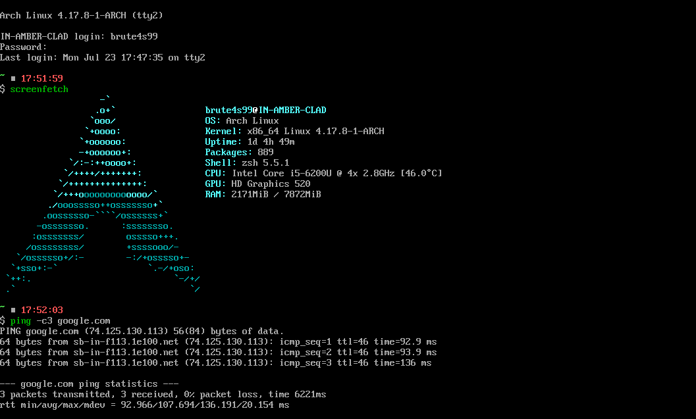
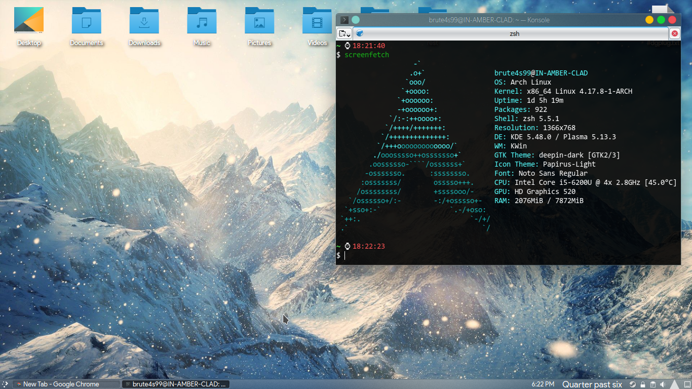

	

> Simplicity is the ultimate sophistication.  
  -Leonardo da Vinci

After eons of self-doubt and mixed opinion, I finally decided to get Arch Linux up and running in my laptop!
## **How it all began?**

My mentors at IRC insisted upon switching over to latest Linux distros. The reason was implicit: to work with packages having latest features. My IRC friends at [#dgplug](https://brute4s99.gitlab.io/dgplug/) suggested me a few flavors to choose from- latest Ubuntu build, latest Fedora build, or a rolling release distribution.
## What’s a Rolling Release?

A rolling release is a type of [linux distribution model](https://en.wikipedia.org/wiki/Rolling_distribution) in which instead of releasing major updates to the entire operating system after a scheduled period of time, a rolling release operating system can be changed at the application level, whenever a change is pushed by [upstream](https://en.wikipedia.org/wiki/Upstream_(software_development)).

There are a couple of rolling release models – semi-rolling and full rolling – and the difference is in how and what packages are pushed out to users as they become available.

A semi-rolling distribution, such as [Chakra Linux](https://www.chakralinux.org/) and [PCLinuxOS](https://www.pclinuxos.com/), classifies some packages to be upgraded through a fixed release system (usually the base operating system) in order to maintain stability.

A full rolling release, such as Gentoo, Arch, OpenSUSE Tumbleweed, and Microsoft Windows 10, pushes out updates to the base operating system and other applications very frequently – sometimes as often as every few hours!
## Why switch?

The main benefit to a rolling release model is the ability for the end user to use the newest features the developer has enabled. For example, one of the newer features of the Linux kernel, introduced with the 4.0 update, was the ability to update the kernel without restarting your computer. In a rolling release distribution, as soon as this update was tested and marked as working by the development team, it could then be pushed out to the user of the distribution, enabling all future updates to the kernel to occur without computer restarts.
## What’s new?

For ubuntu users, it’s the same thing as if you come to Linux from Windows; there is a learning curve.

An excerpt from the [Arch Wiki](https://wiki.archlinux.org/index.php/Arch_Linux#Principles) states thus:-

> Arch Linux is a general-purpose distribution. Upon installation, only a command-line environment is provided: rather than tearing out unneeded and unwanted packages, the user is offered the ability to build a custom system by choosing among thousands of high-quality packages provided in the [official repositories](https://wiki.archlinux.org/index.php/Official_repositories) for the [x86-64](https://en.wikipedia.org/wiki/x86-64) architecture.

Oh, and one more thing- none of the proprietary softwares/packages/drivers come with the base installation. [Read more about them here](https://en.wikipedia.org/wiki/Proprietary_software).

If you still think you can steer clear off the proprietary softwares , [think again](https://bbs.archlinux.org/viewtopic.php?id=87170), and [one more time](https://www.reddit.com/r/archlinux/comments/56zcuf/what_proprietary_commercial_software_do_you_use/).

Theory’s over.
## Baby Steps

A few pointers before we start the installation:-

1. The installation requires a working internet connection. So, I had a wired ethernet connection ready at my disposal.  A WiFi module that’s NOT with a Broadcomm Chipset would be just as fine. Since I have the Broadcomm Chipset, I switched to wired connection for the time being.
2. Once I’ll get the installation done, all I’ll have is a bare-bones installation with a log-in shell. You must absolutely be comfortable with the terminal, as almost no graphical utility comes out of the box.

I grabbed a USB and prepped it with this [Arch Linux img](https://www.archlinux.org/download/). First thing after booting from the USB – I connected to the internet.

> In case you have **Broadcomm chipset in your WiFi**, follow [this](https://wiki.archlinux.org/index.php/Broadcom_wireless). You need the driver firmware for the Broadcomm chipset to get it working on your laptop, since it’s proprietary.

## Connecting to the Internet
### Connecting to internet via Ethernet

Just Plug n Play, you’re good to go!
### Connecting to internet via WiFi

1.Create a profile for your wifi in there

`# wifi-menu`

2.Connect to the profile you set by

`# netctl start <profile_name>`

3.If you want to enable it to connect automatically at startup

`# netctl enable <profile_name>`
### Connecting to internet via Android USB tethering

1.List all your DHCP interfaces that are now available

`$ ls /sys/class/net`

2.Connect to the new inteface provided by Arch for your USB tethered device!

`# dhcpcd <enp....something_profile_name>`

Check if you’re online :    `$ ping -c3 google.com`
____________________________________________________
There are many good tutorials out there, [follow any one of these](https://duckduckgo.com/?q=install+arch+linux+uefi).

Now that Arch was installed, I booted up the system and got connected to the internet again.

Now that I was online, I set up a GUI !
## Installing a GUI

So the first thing I decided to get for the Arch was GUI! It’s a quite simple procedure, you need a display manager, and a Desktop Environment to interact to the X server.

> ## X Server
> X is an application that manages one or more graphics displays and one or more input devices (keyboard, mouse, etc.) connected to the computer.  
> It works as a server and can run on the local computer or on another computer on the network. Services can communicate with the X server to display graphical interfaces and receive input from the user.

My choice:  `# pacman -S sddm plasma`

#### IMPO ! Install a terminal before rebooting to GUI !

`# pacman -S konsole`
## Configuring terminal

Sources + References:-

1. http://jilles.me/badassify-your-terminal-and-shell/

### Configuring weechat

Sources + References:-

1. https://alexjj.com/blog/2016/9/setting-up-weechat/
2. https://wiki.archlinux.org/index.php/WeeChat

Surfing through some sites also got me through a good command that would be of much help to most!

`/mouse enable`  # In case you’d like to use the mouse in weechat

`/redraw`          # A saviour for guys SSH-ing to any [ZNC](https://en.wikipedia.org/wiki/ZNC)
## You can’t find the packages through pacman?

Enter AUR : the [Arch User Repository](https://wiki.archlinux.org/index.php/Arch_User_Repository)

Suppose I have to get a package that cannot be found by pacman. I will try to find it at [AUR home page](https://aur.archlinux.org/).

for eg : [ngrok](https://aur.archlinux.org/packages/ngrok/). Now, after reading description, I know this is the package I was looking for. So, now I will see how I can acquire the package.

Here I can see two ways to acquire the package- by git clone (preferred), or by downloading the **tarball**.

It gives me one file : PKGBUILD . These **PKGBUILD**s can be built into installable packages using makepkg , then installed using pacman .

> ## Fakeroot
> Imagine that you are a developer/package maintainer, etc. working on a remote server. You want to update the contents of a package and rebuild it, download and customize a kernel from kernel.org and build it, etc. While trying to do those things, you’ll find out that some steps require you to have **root** rights (**UID** and **GID** 0) for different reasons (security, overlooked permissions, etc). But it is not possible to get **root** rights, since you are working on a remote machine (and many other users have the same problem as you). This is what exactly **fakeroot** does: it pretends an effective **UID** and **GID** of 0 to the environment which requires them.  
P.S:-
> -    UID: User ID
> -    GID: Group ID

The git clone method is preferred since you can then update the package by simply git pull.
## Why so much fuss ?

You can always try out [AUR helpers](https://wiki.archlinux.org/index.php/AUR_helpers). I set up [yay](https://aur.archlinux.org/packages/yay/) in my configuration, since it also shows DIFFs when installing new/upgrading packages through AURs.

> ## Why would you want to read DIFFs?
> Essentially, it’s a shell script,(so it can possibly have mailicious / dangerous content, so look before you leap) but since it’s ran as fakeroot, there is some level of security albeit. Still, we shouldn’t try and push our luck.

So after all this, I successfully set up Arch Linux, WiFi, Desktop Environment, Terminal and Weechat in my laptop! Next was installing basic software packages and fine tuning the GUI to my personal tastes.

Firefox Developer Edition – For Web Browsing

tor-browser – For private internet access

Konsole – Terminal

Deepin Music Player – Music Player

Gwenview – Image viewer and editing solution

Steam – for Games

Kontact – for updates on calendar events

VLC – Video player
The end result

 beautiful, isn’t it?

Setting up a personal Arch Linux machine taught me many things about the core Linux system, how exactly the system is set up during installation and how different utilities orchestrate to form my complete workstation ready to build beautiful code and software!