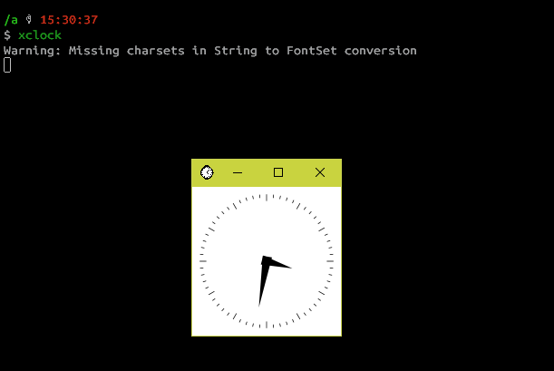
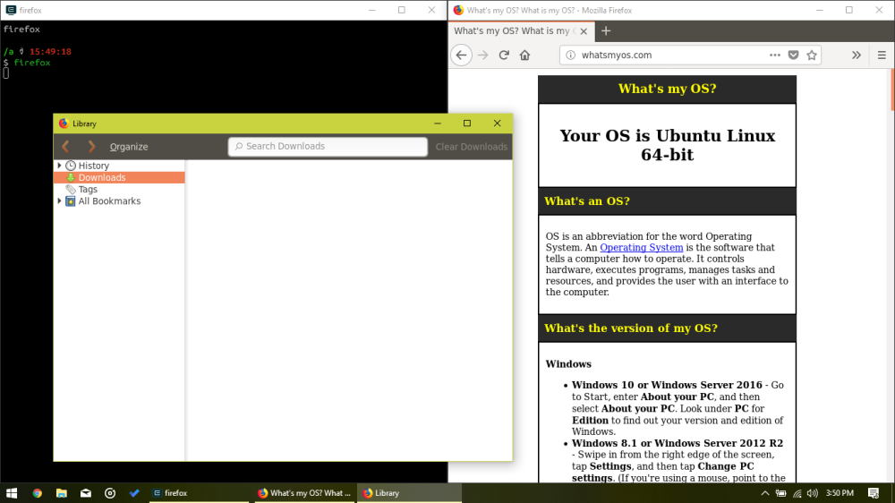
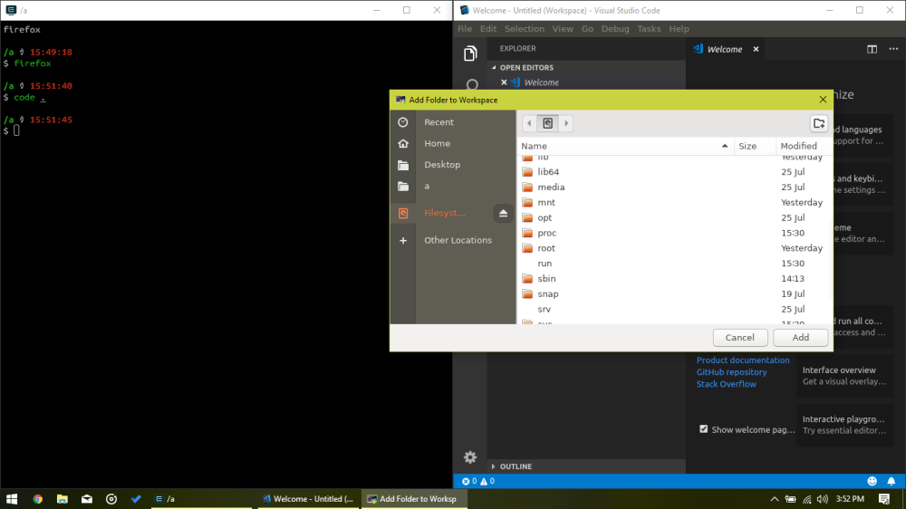

# PROLOGUE

While setting up Dev environment on my CAIRO-STATION (desktop computer at my home), I realized I could not install Linux on that, since the system will be used by all family members. My best bet would have been a VM or some sort of Containerization. Then I recalled my early development days, and realized both of these are inferior to [Windows Subsystem For Linux (WSL)](https://www.howtogeek.com/249966/how-to-install-and-use-the-linux-bash-shell-on-windows-10/)

When I first discovered WSL as an optional feature in Windows 8.1, I was busy jumping between playing Just Cause 2 (a really great Open-World game, you [MUST](https://www.youtube.com/watch?v=oTXqYg_S4Ps) check it out!) and studying for XII “Board Exams”. I had a slight taste of Linux back then, enough to perform the most basic functions- ls, cd, and **screenfetch** (my favorite).

Then, last year I saw Microsoft announce 3 more Linux flavors for WSL incoming at [Build Developer Conference](https://techcrunch.com/2017/05/11/microsofts-bash-on-windows-10-goes-beyond-ubuntu-and-gets-support-for-fedora-and-suse-too/), all I understood was more screenfetch outputs to bask in!
# Motivation

Today, after an year of experience and two incredibly knowledgeable months at [DGPLUG](https://mindretfarc.wordpress.com/2018/07/10/dgplug/), ideas have become more **achievable**.

Today, an idea struck my mind-

> Developers can finally use Ubuntu through command line interface, great! If they could also use **GUI** apps fired from within the Ubuntu bash CLI, ah that would have been lovely.

Ever since I [installed Arch Linux](https://notes.piyush.tech/arch_zero_to_one/) on my system over days of research, I came to appreciate all the nit-bits and procedures involved in installing an OS and everything that a proprietary-software user believes *should* come with it.

Since now I possessed the knowledge I needed to pull this off, I fired up my home PC and I was ready to hack!
# Baby Steps

1. Got [Ubuntu 18.04](https://www.microsoft.com/en-us/p/ubuntu-1804/9n9tngvndl3q?activetab=pivot%3aoverviewtab) from windows store.
2. [Turned ON WSL](https://docs.microsoft.com/en-us/windows/wsl/install-win10) for my system.
3. Updated all packages and installed screenfetch.

# The New Part

The **X Server** handles outputs to the GUI, and a variable DISPLAY needs to point to the X Server. This was done by the command DISPLAY=:0. To avoid running it manually everytime, I appended it to my shell by the command: `echo 'DISPLAY=:0' >> ~/.zshrc`.

Now, all that I needed was an X Server that serves well!

My first attempt at X-Server for Windows was XMing, but unfortunately it couldn’t be detected by the WSL.

X Server could not be found by WSL

Next up, I tried another procedure which goes as follows :-

1. WSL opens up a TCP type port 2222 for SSHing.  
2. I SSH through PuTTY and enable X11 Forwarding inside it.
3. The X Server used was still Xming.

The result is in the following photograph.

Some Progress!

There still were problems with this set up- Latency. It seems obvious that I am SSHing into my own system, which is not wise. So, now I decided to get a better terminal application and get this show on road!

So, this time, I installed [ConEmu](https://conemu.github.io/). For those who are having a hard time shifting from Linux to the Command Prompt or Powershell, this is a relief. ConEmu is extremely customizable and rock-solid!

Also, I changed my X Server to [MobaXterm](https://mobaxterm.mobatek.net/), which does a far better and simpler job at handling X Server and related tasks(Servers,Tunneling,Packages,File System )
# Final Set Up

The MobaXTerm X Server starts at Log In, and firing up ConEmu gives me a Ubuntu CLI.
# Testing

 

Mozilla Firefox

VS Code

I also followed a blog post by Nick Janetakis on [setting up Docker to work with WSL flawlessly](https://nickjanetakis.com/blog/setting-up-docker-for-windows-and-wsl-to-work-flawlessly)!

The setup he used was my inspiration for the post, and I hope it would serve me well for my oncoming endeavors!
