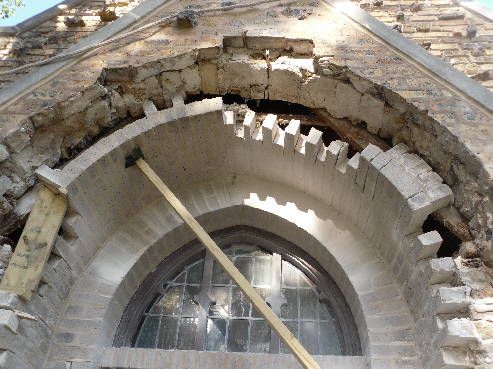

<p align='center' ><font size=3> easier than it looks</font></p>

## PROBLEM 

Not clear, but looks like misconfigured packages after multiple installations, uninstallations and re-installations of packages and Desktop Environments

## PROLOGUE

So today I had problems that caused KDE Plasma to *not acknowledge* my laptop as a laptop.
In other words, my Arch was on the edge of collapse.

## BABY STEPS

So, I tried reinstalling all the packages of my installation in one command, like so
```
# pacman -Qenq | sudo pacman -S -
```
But as you can see the post hasn't ended here, it didn't pan out.

## SOLUTION

After hours of help at #archlinux and #kde-plasma, I found [this Forum page](https://bbs.archlinux.org/viewtopic.php?id=193174) that gave me just the right instructions!

1. First up, I removed all the orphaned/unused packages rotting away in my system.

    ```
    # pacman -Rns $(pacman -Qtdq)
    ```

2. next, I **force-reinstalled** all the packages I had in my installation.

    ```
    # pacman -Qqen > pkglist.txt
    # pacman --force -S $(< pkglist.txt)
    ```

## EPILOGUE

Now my installation is sweet as candy with no loss of any personal configs, and everything is perfect again! 
<p align='center'> 😄 🎉 </p>
