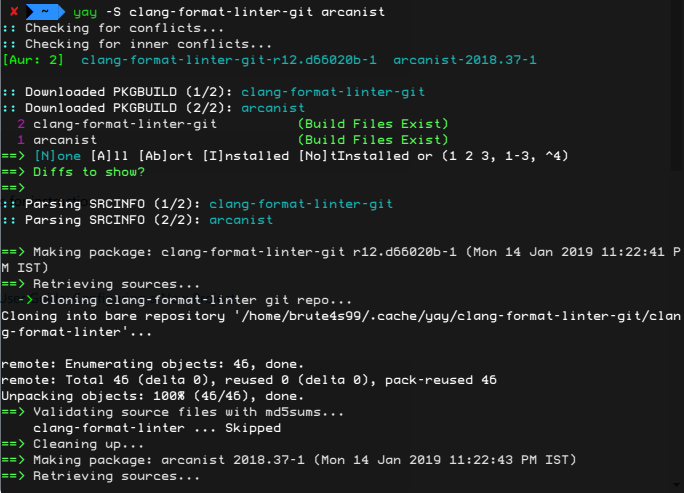
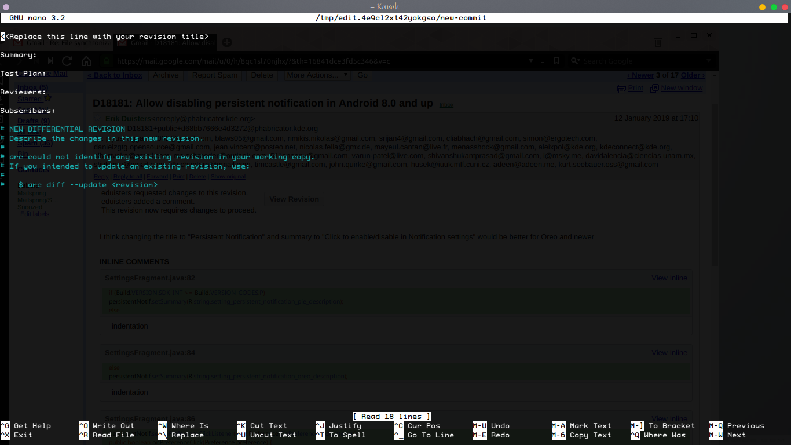

<p align='center'><br>
<a href="https://phabricator.kde.org/"><font size=2>Phabricator</font></a></p>

## INTRODUCTION
This post is dedicated to Arcanist, a command-line interface to Phabricator.
Phabricator is a set of tools that help [KDE](https://www.kde.org) build better software, faster.

Various command-line based solutions out there help developers to acheive good workflow across features and projects(Git, Mercurial *et al*); Arcanist takes the same approach, but feels a lot more practical to me.

[Arcanist User Guide](https://secure.phabricator.com/book/phabricator/article/arcanist/) states thus:-
> Arcanist provides command-line access to many Phabricator tools (like Differential, Files, and Paste), integrates with static analysis ("lint") and unit tests, and manages common workflows like getting changes into Differential for review.


## Setting up Arcanist

The two dependencies to Arcanist are - `git` and `php`. Install them using `sudo pacman -S git php` (or equivalent for your distro).

Then you can install Arcanist itself. 
It was as simple as `yay -S arcanist` for me.

Other distros' users may want to look for **Installing Arcanist** subsection in  [Arcanist quick start](https://secure.phabricator.com/book/phabricator/article/arcanist_quick_start/).

Next up, get the source code of the project you wish to work on by [cloning it from cgit](https://cgit.kde.org/).

Now then, let's dive into development! 🤖

## Development with Arcanist

1. You may find an interesting [bug from KDE's bug tracker](https://bugs.kde.org/describecomponents.cgi) or [task from your project's Workboard](https://phabricator.kde.org/).

2. **Always create a feature branch/ bookmark** before touching any file in a clean clone. Use `arc feature` for it.
    ```
    arc feature name_of_feature_branch
    ```

3. Poke around, play with the code, do your thing.

4. When ready to submit a patch, type in `arc diff`. This will also help you maintain your submitted patches. Complete the following forms, that look like:-


5. That's it! Your patch is submitted for review! You also get a link to share with others and see how the submission looks on Phabricator!

6. Continue hacking on another bug or Task, and wait for the review on the submiited patch! 

>Remember to make a different feature branch beforehand!

## Tips
The world is not perfect, and many-a-times the reviewers will suggest changes to the patch before flashing the green light. Just revisit the branch, do the changes required, and hit `arc diff` again! 

If you're not sure about this, use `arc diff --preview`. I always use it before associating a diff with a submission! 😉

## `arc patch`

You can always try out any submitted patch along with the latest `master` by using the `arc patch` command!
```
arc patch D18812
```
This command will do the following in definite order:-
1. create a new feature branch with name `arcpatch-D18812`.
2. apply [patch D18812](https://phabricator.kde.org/D18812).
3. set local tracking to the local branch `arcpatch-D18812`.
4. checkout `arcpatch-D18812` feature branch.

Don't worry, even if it's an old patch, Phabricator remembers the `master` branch commit the current patch was based on!
As an example:-
>If you pull a particularly old patch, say D16553, I get a branch **based on commit 657dec**, whereas the current HEAD of master is 708bcb !

## `arc feature`

Suppose you were at `master` in your clone, and you do `arc feature some_name`. Now, `some_name` branch will be set to track the local `master`, as in if you commit anything to *just* the local copy of `master` that you have, and then `git checkout some_name`, `git` will ask you to `perform "git pull" as your current branch is behind by some commits`.

### TL;DR

doing `git pull` in `some_name` will import the changes from the last branch you `checkout`ed, before `arc feature some_name`.

## `arc land`
Perform `arc land` after you have completed the following checklist:-

- [ ] Your submitted patch has been **accepted by reviewers**.
- [ ] The reviewer(s) have **EXPLICITLY tasked you to `land the patch`**.
- [ ] You **do** have a [Developer Access Account](https://community.kde.org/Infrastructure/Get_a_Developer_Account) in order to land the patch.

`arc land` automatically rebases (and errors if that failed), so you don't have to do that manually, unlike `Git`.

<p align='center'> <font size=3> This quickstart should be enough to get you started on KDE's Phabricator and setting sail on some binary adventures!</font></p>
