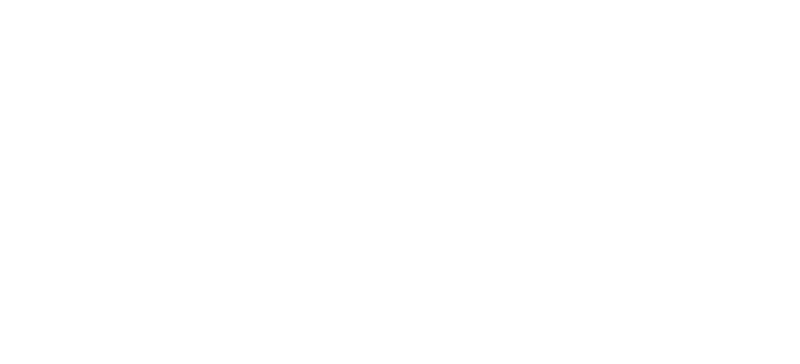
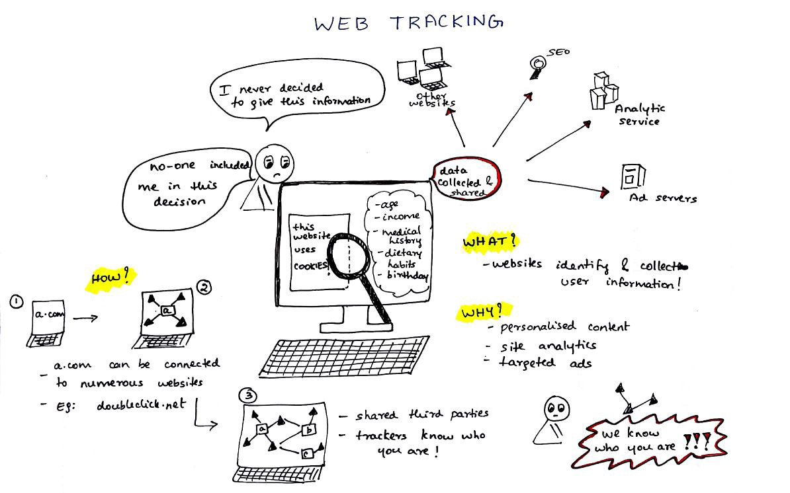
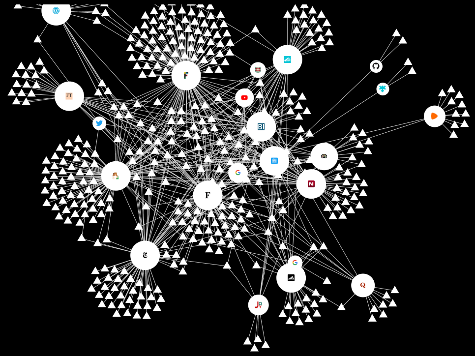

 
Free as in freedom

## INTRODUCTION
When I started using this static blog, little did I know of all the trackers that came with the supporting resources used in a cool starter like this one. In this post, I explain the various kinds of trackers and also a personal teaspoon of what trackers I dealt with, while sterlising this blog!

## How does browser tracking work?

When you visit a website, third-party trackers (cookies, pixel tags, etc) get stored on your computer.

How many trackers exist in any given website depends on how many the website owner has decided to include. Some websites will have well over 60 trackers, belonging to a multitude of companies, while others might have only one - perhaps to track visitor numbers, or see where these visitors are coming from, or to enable a certain functionality. Some might have none at all. 

Not all trackers are necessarily tied to companies tracking your browsing habits - but when you **accept cookies**, you're saying `ok` to *all* the trackers that are there - including those feeding info back to companies.

## What is being collected and Why?

Trackers collect information about which websites you're visiting, as well as information about your devices.

One tracker might be there to give the website owner insight into her website traffic, but the rest belong to **companies whose primary goal is to build up a profile of who you are**: how old you are, where you live, what you read, and what you're interested in. 
This information can then be packaged and sold to others: advertisers, other companies, or governments.

They are also joined by more well-known companies. Some of these are even visible: Google's red G+ button, for example, is a tracker;  Facebook's "like" thumb is a tracker; and Twitter's little blue bird is also a tracker.

## Why does it affect me?

Data companies and advertisers also know which articles you read and which ones you skip, which videos you watch, and which ones you stop after 5 seconds; which promotional emails you read, and which ones you send to your Trash folder without opening; what you like on Facebook, what you retweet, what you heart on Instagram. 

When you put all these things together, you end up with your own unique online fingerprint — which immediately identifies you, with all your likes and dislikes and personal traits

And that’s potentially very bad news, because once they know exactly who you are and what makes you tick, companies and advertisers can:

- **spam you with finely-tuned, targeted ad campaigns** that follow you around the web.
- potentially **jack up their prices for you**. 
- **invade your privacy** and chip away at your anonymity online, which nobody likes. 

  An illustration from a <a href="https://medium.freecodecamp.org/what-you-should-know-about-web-tracking-and-how-it-affects-your-online-privacy-42935355525">post</a> by <a href="https://twitter.com/princi_ya">Princiya</a> She writes on awesome topics at FreeCodeCamp, you should check out here posts!

## Tracking mechanisms

### Cookies
Cookies are the most widely known method to identify a user. They use **small pieces of data (each limited to 4 KB) placed in a browser storage by the web server**. When a user visits a website for the first time, a cookie file with a unique user identifier (could be randomly generated) is stored on the user’s computer.

Subsequent visits to the Facebook page do not require you to login, because your details will be remembered by the browser through a cookie stored during your first login.

### Browser fingerprinting
Browser fingerprinting is a highly accurate way to identify and track users whenever they go online. The information collected is quite comprehensive, and often includes the browser type and version, operating system and version, screen resolution, supported fonts, plugins, time zone, language and font preferences, and even hardware configurations.

These identifiers may seem generic and not at all personally identifying. But, **typically only one in several million people have exactly the same specifications as you**.

### Web beacons
**Web beacons are very small, usually invisible objects embedded into a web page or email.** Web beacons are also referred to as “web bugs,” which also go by the names “tags,” “page tags,” “tracking bugs,” “pixel trackers,” or “pixel gifs.”

In their simplest form, they are tiny clear images, often the size of a single pixel. **They download as an image when the web page is loaded, or the email is opened, making a call to a remote server for the image.** The server call alerts the company that their email has just been opened or their web page visited.
This is why you should not display images in emails from senders you do not trust.

Web beacons are also used by online advertisers who embed them into their ads so they can independently track how often their ads are being displayed.

## The Anonymization Myth

Most companies claim that they don't identify you by name when they hand over a profile of you - but what does that really mean, when **you can be identified easily through all the other information included**?

Here's a [good read on anonymization](https://tdwi.org/articles/2018/09/04/dwt-all-anonymization-myth.aspx).

## Protecting your-**self**

While companies (sometimes) allow users to take away their data off the company servers (for eg: [Google TakeOut](https://takeout.google.com/settings/takeout) and [Facebook](https://www.facebook.com/help/1701730696756992/)), one can never be sure if that is the real deal or not. Companies might be still be retaining derivatives or seemingly "anonymous" attributes from user data. As such, it's always a better move to restrain giving away information as much as possible. Some ways are discussed below.

1. Use browser add-ons.
    >Many add-ons like [Privacy Badger](https://www.eff.org/privacybadger) from [EFF](https://www.eff.org) allow for users to take a look at all the third party trackers enabled by the website's owner, and disable them.

2. Use [Tor](https://www.torproject.org/) or a VPN.

    > If you connect to the Tor anonymizing system, or use Tor's browser, your ISP will only know that you have connected to Tor; from there it loses the data trail. Of course the downside to this is that your browsing will be slower.
    >
    > Be aware, your unencrypted traffic to websites outside the Tor network passes through a complete stranger's exit node: the person running the exit node can watch what you're doing. All you've done is move from your ISP snooping on you to an exit node admin watching you. On the other hand, you'll cycle through different exit nodes, so it's harder to be identified and tracked by websites outside the Tor network.

    >A virtual private network is an alternative that will work for lots of people, especially if your work has a VPN service that you can use for free. This again will cut off your ISP's ability to see what you are doing.
    >
    >**But** do some research on your VPN provider. Do NOT use a free VPN provider because they face even stronger financial temptations to sell your information. If you use a VPN, you are effectively giving that company the same level of insight into your online life as your ISP. So pay for one, and check out their policies on what they do with the data they build on you.

3. Use a different search engine.
    > Google offers a wonderful service, but everything you type in its search box is logged and connected to you in as many ways as possible. It is then sold on.
    >
    >So why not use a different search engine? [DuckDuckGo](https://duck.co/help/desktop/adding-duckduckgo-to-your-browser) is an awesome search engine with NO user data logging.This Qoura answer tells more about [features of DuckDuckGo](https://duck.co/help/company/advertising-and-affiliates).

    
## Getting rid of some trackers from your site

1. `ajax.cloudflare.com` 

    >inherent on websites hosted by Cloudflare's DNS.

2. `graph.facebook.com`
    
    >active when Facebook's developer services (for eg: FB Comments plugin) are loading on a webpage.

3. `clients6.google.com`
    
    >active when webpages directly call Google servers for Javascript codes.

4. `fonts.gstatic.com`
    
    >active when Google fonts are called for CSS scripts.

5. `www.linkedin.com`

    >active when there are links to linkedin in the webpage.

## Tracking the trackers

 Lightbeam from [Mozilla](https://www.mozilla.org/) is privacy browser extension helps you discover who’s tracking you online while you browse the web. 
 
 You can get it [here](https://addons.mozilla.org/en-US/firefox/addon/lightbeam/).

## Some links

- [Facebook's data exchange](https://www.theatlantic.com/technology/archive/2018/12/facebooks-failures-and-also-its-problems-leaking-data/578599/)

- [The WebTAP Project](randomwalker.info/publications/webtap-chapter.pdf)
- [Third-party tracking on the web](www.franziroesner.com/pdf/webtracking-NSDI2012.pdf)
- [Mozilla Privacy Basics](https://learning.mozilla.org/en-US/activities/privacy-basics/)

  Stay safe and make the internet a healthier place! 

