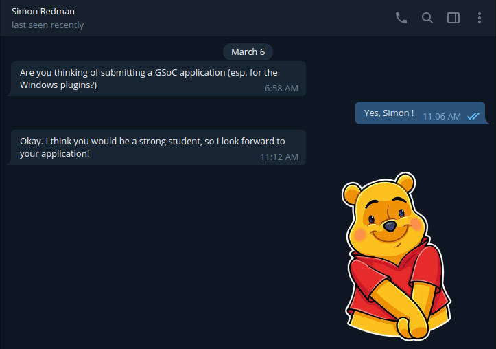
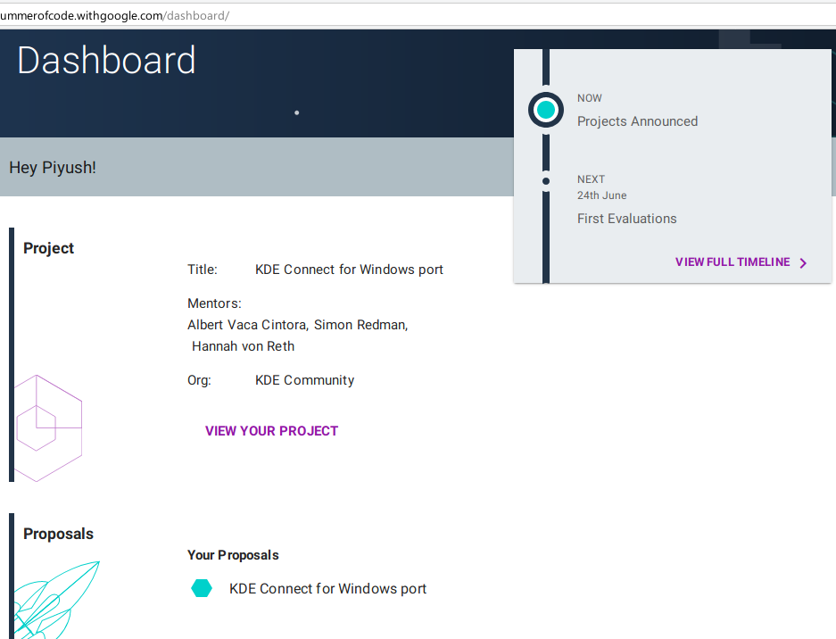

## PROLOGUE

<blockquote>
Peace in our time. :)

Tony Stark

</blockquote>

I have seen some of my college mates bag internships to work at hot technologies like Deep Learning, Android, at places like DRDO and Microsoft, with stipends more than the income of an average Indian fresh out of college. Having grown up as a king of the hill, I obviously started feeling sick of always catching up.
When I started my FOSS journey on 16 June 2018 with [#dgplug](https://journal.piyush.tech/a_real_life_hogwarts/), little did I know where would I be one year later. :)

Ever since I came back from the PyCon India 2018, Hyderabad, I've been a lot more involved in public speaking, volunteering at technical events and KDE. This is a recap, that aims to cover the important events of the past year that led to this- a GSoC 2019 student.

## BABY STEPS

The training at #dgplug taught me the basics of IRC communication, guidelines of how to communicate in mailing lists, and also seeded this habit of regular blogging within me. With the knowledge from my summer training, I headed on to the first software that came to my mind - pandas.

When I started contributing to pandas, it took me over a couple months at my PRs to get merged in master. I contributed both in code, and documentation, and fortunately, I had the rare chance of meeting my PRs' reviewer Marc Garcia at PyCon India 2018. He came in as the devsprint mentor for pandas. It's nothing short of a magical experience to have the reviewer explaining to you **in person**, stuff like development flow and stuff that is usually left behind the internet. After meeting so many awesome people in real life, I understood this is my gig.
After a couple of [merges](https://github.com/pandas-dev/pandas/pulls?utf8=%E2%9C%93&q=is%3Apr+sort%3Aupdated-desc++brute4s99) in pandas, I decided to start contributing in a much bigger organization on a software that I use daily and is also used by the masses i.e the end users. Since I used plasma DE by KDE, along with a host of other software that came along, I locked my eyes on KDE.

I started talking about contributing to KDE on #dgplug, and Kuntal Majumdar [(hellozee)](http://github.com/hellozee/) there advised me to visit #kde-devel and #kde-soc. From there on, my KDE journey began and I started lurking in the IRC channels since October - mid. There I met Valorie Zimmerman, a KDE Admin, who helped me a lot to get to a project I love to use. It was she who helped me realize KDE Connect was the project I was looking for.

> If you contribute to a project you love, you will keep contributing to it for a long time, even without any sort of motivation

Right around the end of October, I joined the KDE Connect's IRc-bridged Telegram channel and asked for guidelines to start with developing KDE Connect. Luckily, many of the developers at KDE Connect help almost instantaneously, no matter what time of the day, thanks to a wide-spread developer group.

>There are not a lot of developers at KDE Connect, but luckily they are spread across the globe and cover all possible times of the day. 
>
>Kudos to remote working!

## TOUGH CHOICES

>There can be a lot of points in your journey, when you feel a tension because you're finally able to wrap your head around an awesome project that you wanted to work on, but then some opportunities popped up that could slingshot you right into the middle of hot technologies that interest you.

One such choice came to me right around mid November, when I got shortlisted for the [PyTorch Scholarship](https://www.udacity.com/facebook-pytorch-scholarship). This scholarship could help me get into the thick of Deep Learning, a technology I love to read about and work on occasionally. Albeit, I decided to drop it and focus on one thing at a time.

## MOVING ON

I started my contribution with a pretty obvious bug, which involved wrong titles for some KDE Connect plugins in the Android app. Luckily(for me :p) no one noticed it yet, so I had a good chance to start working on Android (which I used to hate, or maybe dread). I made the patch and it took about a week or so to get merged. It was a great feeling to get a patch in kDE Connect, but it took about a month of lurking and stumbling and asking questions, and then I ultimately had my first teensy contribution by mid - December. 

## PREPARATION TO PROPOSAL

It was right around this time that [Albert Vaca](https://github.com/albertvaka), maintainer of KDE Connect, mentioned that KDE Connect for Windows can be a GSoC project this time around. I was elated to see that message, and asked him if I could target it for my summer. He allowed it, but it needed a good enough proposal, and a ton of contributions.

>Mentors need to believe in the student(s) they pick; while GSoC can get new lifelong contributors to awesome projects, on the other hand it can also end up with useless code dump and a lot of headache for the prior developers.

Since then, while fishing for more fairly easy bugs to fix, I also started to check out the Windows build and what challenges I would be facing while working on it.

I also used to talk to [jambon_t](https://github.com/jambonmcyeah), a then-active contributor to the Windows build, and learn some know-how of the Windows development.
For a school student, he is way more knowledgeable in working on the Windows build.

## A TWIST

Some sinister chemical sneaked into Delhi's fast food stalls in early Feb. Thanks to it, many people, including myself, got very badly ill. I was unable to work, or even visit college for most of February because of an upset stomach and a heavy head.

## PROPOSAL

After a couple months of 2019, I was able to build a POC that demonstrated native notifications on Windows, that were forwarded by the connected android device. After a couple hours of sending the screenshots on KDE Connect Telegram group, I got a message by [Simon Redman](https://github.com/sredman), a developer at KDE Connect. It read:-

 

It's a really awesome feel when someone actually recognizes your efforts after long.

Since then, I worked hard on creating the perfect proposal. I got a lot of feedback from various KDE Developers and reviewers. The expertise of Windows development by [Hannah Von Reth](https://github.com/theonering), the maintainer of Craft, was a huge help in pretty much every bump I encountered while researching for the Windows port. She is also one of my mentors at the GSoC project, along with Simon and Albert.

After tons of suggestions and fixes, I submitted [my final proposal](proposal.pdf).

After that, I did not stop. The prime motivation when I started contributing to KDE Connect, was giving back to the community. With that thought, I kept contributing and contacted my mentors in times of trouble.

## FAST-FORWARD TO MAY 6, 2019 : UTC 17:30

30 minutes to Google's announcement for students selected this year for the GSoC, I started listening to calming Indian songs like "Breathless", "Kun Faya Kun" *et al*. I poked my mentors, but they refused to let the cat out of the bag. I waited for the time while fixing my Windows devflow which somehow started crashing.

Right when 1800 struck, I looked at the browser screen and hit refresh at my GSoC dashboard. The servers must have got under heavy load, just like the CBSE results day in India. I went ahead to fire up another browser window in a state of panic, and lo! The page loaded itself:-

## EPILOGUE

Well, I am in now, with responsibilities of a GsoCer on my shoulders. [This](https://summerofcode.withgoogle.com/projects/#6226488775409664) is the link to my GSoC project.

I just wish for the strength to push (pun intended) through all the proposed milestones and to be able to make an awesome release before [Akademy 2019](https://akademy.kde.org/2019). ^-^

This post is bit late to be a welcome to GSoC post, but this post marks the day I did my first merge as a [KDE Developer](https://invent.kde.org/kde/kdeconnect-kde/merge_requests/52/) ! I look forward to many more interactions with the KDE Community, now that I've **Set Sail For Adventure!**

  Stay safe and make the internet a healthier place! 

